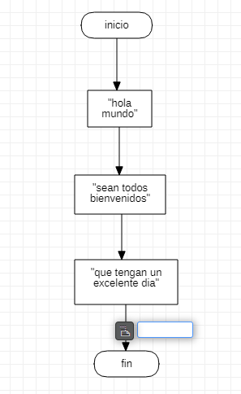

# programacion
aprendi en visual basic colocar el comando MsgBox
# ejercicio excel

```
sub ejemplo()
    MsgBox "hola mundo"

end sub
```
```
Sub ejemplo()
    MsgBox "hola mundo"
    MsgBox "sean todos bienvenidos"
    MsgBox "que tengan un excelente dia"
    
End Sub
```
