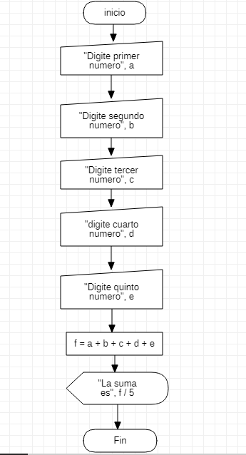

# programacion 2
aprendi a ejecutar una suma de 5 digitos y dividirlo
# ejercicio en excel

```
Sub ejemplo()
    a = InputBox("Digite primer numero")
    b = InputBox("Digite segundo numero")
    c = InputBox("Digite tercer numero")
    d = InputBox("Digite cuarto numero")
    e = InputBox("Digite quinto numero")
    f = Int(a) + Int(b) + Int(c) + Int(d) + Int(e)
    MsgBox " La suma es " & f / 5
End Sub
```
# Diagrama de Flujo


