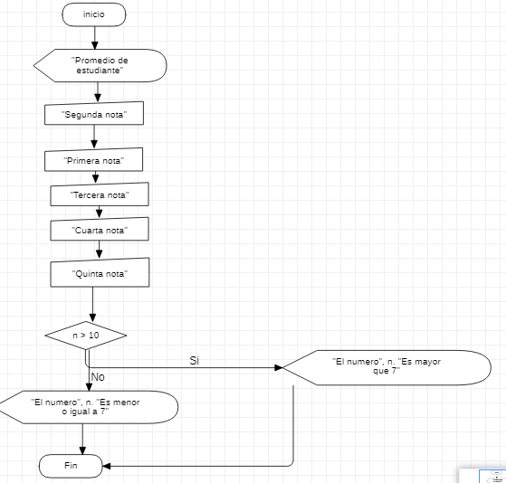

# programacion 3
aprendimos en visual basic a sacar un promedio del estudiante con una serie de notas utilizando el codigo Int(InputBox("texto"))
# ejercicio en visual basic

```
Sub ejemplo1()
MsgBox "promedio de estudiante"
    materia1 = Int(InputBox("primera nota"))
    materia2 = Int(InputBox("segunda nota"))
    materia3 = Int(InputBox("tercera nota"))
    materia4 = Int(InputBox("cuarta nota"))
    materia5 = Int(InputBox("quinta nota"))
    f = materia1 + materia2 + materia3 + materia4 + materia5
    a = f / 5
    MsgBox "la suma de las notas es " & a
    If (a > 7) Then
        MsgBox "con el promedio " & a & " es igual o mayor a 7 "
        MsgBox " gano promedio "
        
    Else
        MsgBox "con el promedio " & a & " es menor a 7 "
        MsgBox " perdio promedio "
    End If
    
End Sub
```
# diagrama de flujo


